# Sequential-Data-Analysis

Pre-Definition:

A research case is being followed where we generate output for a number of conditions.
Some conditions are assumed; while some are realistic. Each of which has been posted with clear markings and proof of concept.

Concept:

Consider, there is a group of open source software developers with a fixed term to each of their contributions. We have considered software developers into two categories – “core” and “periphery.”

Each of them has been defined and assigned to a certain role:

Core – These are the software developers who are continuously working on the open source software.

Periphery – These are software developers who make contributions to the open source software; with any patch fixes. 

Our goal is to consider the contribution of each of these actors. For this purpose, we make certain assumptions – so as to better understand the contribution and define a relatable permutation and combination.

Now, we have considered core software development team within 3 conditions – 10%, 20%, 50%. These are relative percent which demonstrate the number of core software developers in the open source.

Working:

We have defined the actions of actors as follows – 
Analogies, Assumptions, Merger, Ideas, NRS, Paradox, Questions, References.

For relative understanding, lets mark each of them as a positive, negative and neutral emotion.
Positive: Merger, Ideas, References.
Negative: Paradox, Questions.
Neutral: Analogy, NRS, Assumption.

Each of these have been assigned a number 0 through 7; to uniquely identify the conditions in analysis.
0=Analogy, 1=Assumption, 2=Idea, 3=merge, 4=nr, 5=paradox, 6=question, 7=reference.

We begin with a random member to make decision on the action to be taken. Each of the member, followed is chosen randomly. 
Let’s consider their decision-making conditions – if previous decision was taken by a core member – we use core member matrices else we make the use of periphery matrices.

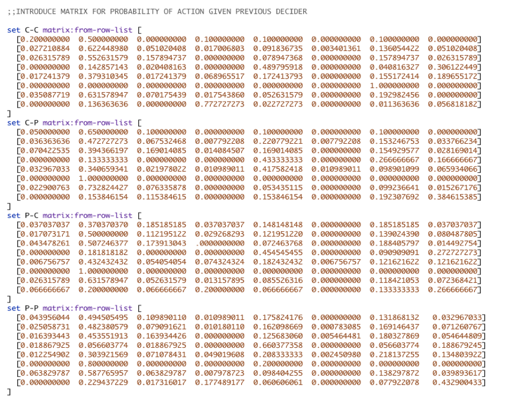
 

Action:

General Outline:

Part 1:
1.	Define a sample of people.
2.	Create a list of sequences using the probabilistic suffix tree.
3.	Prune the tree.

Part 2:
1.	Generate clusters.
2.	Check for quality of the cluster.
3.	Choose number of clusters based on quality evaluation.

Part 3:
1.	Based on the cluster generated, check the distribution of frequencies across clusters. 
2.	Determine how each cluster performs in respective frequencies.

Let’s consider each of the general outline and hence their definition.
Now, a sample of people has been considered; such that they contain open source software developers – consisting of core and periphery developers.
Each of their resulting output – that is the data file (which is cleaned and transposed) has been stored for further conditions.

Now, these lists have been demonstrated with the help of a probabilistic suffix tree.

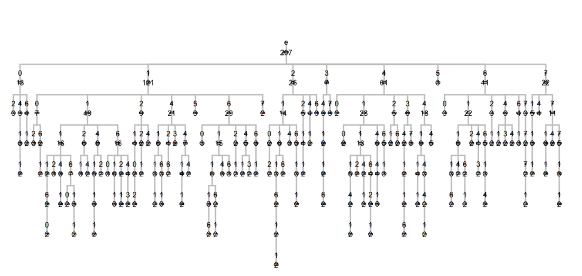

Consider the following conditions on which the tree has been pruned:

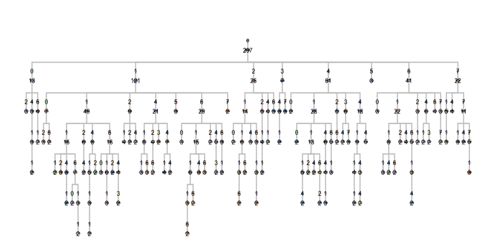

The resulting graph which demonstrates the pruned tree on said condition is as follows:

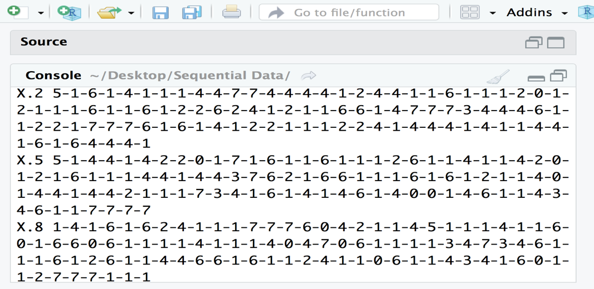 

This graph has the maximum depth of 6. This ends the general outline part 1. Now before considering the second part of general outline lets relate to a few questions – which will help us better in analysis.

a.	How is each of the node configured – that is when actor takes a decision what impacts are made by the previous actor.
b.	What sequence of action has been generated. Is there a repetition to these sequence patterns? What does it signify? 

Consider the following sequence:

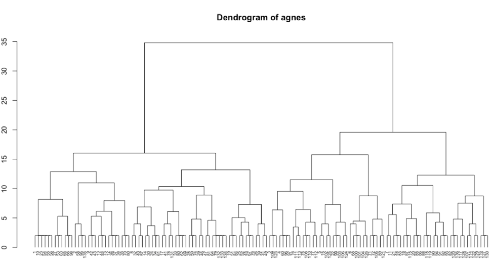

We have generated a dendrogram with the cluster:

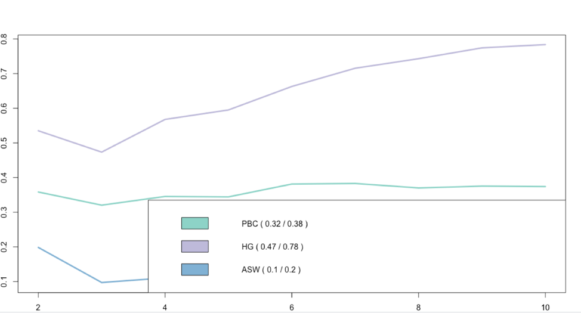 

Part 2 also consist of Cluster Quality.

 
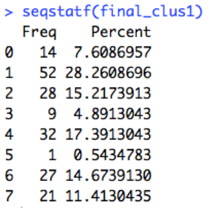

Consider the 3 clusters:

For cluster 1:

 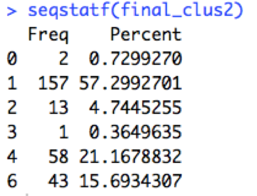

For cluster 2:

 

For cluster 3:

 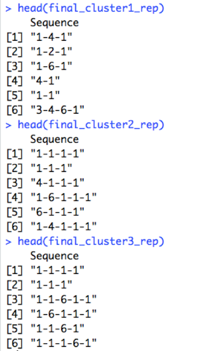

After calculating distance for each of the cluster respectively; Extracting sets of representative sequences and Concatenate vectors of states or events into a character string.

 
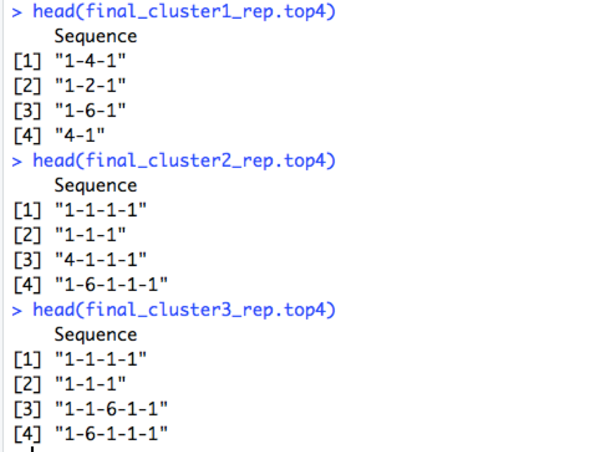

Now we consider the top 4 sequences of each of these sequences.

 

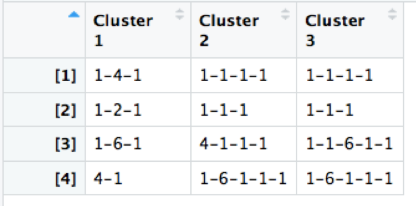

Now consider a combination of each of the clusters where top 4 sequence of each cluster is considered:

 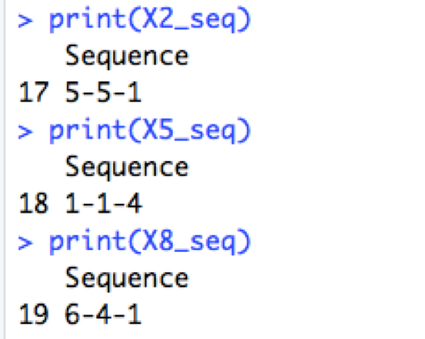

For part 3 of the general outline:

Based on the cluster generated, check the distribution of frequencies across clusters.

 

Proposed Questions:

1.	How is the contribution defined to be a good or a bad contribution? Also, how is it defined that the contribution made by either of the open software developers – core or periphery actually implemented in software.

2.	Whose contribution is more likely to be considered – core or periphery. Does it directly relate to the actions of previous contributor or does it relate to actions of previous contributor belonging to same group.

3.	How does the contribution have an overall effect with different core open software developers – that is 10%, 20% and 50%.

Appendix:

Core – Refers to core contributors of open source software development.
Periphery – Refers to contributors for patch fixing on specific software issues.
Actors – Refers to open source software developers either core or periphery. 

Disclaimer:
I have done this project with Prof: Aron Lindberg.
All the data and information was provided by him.
